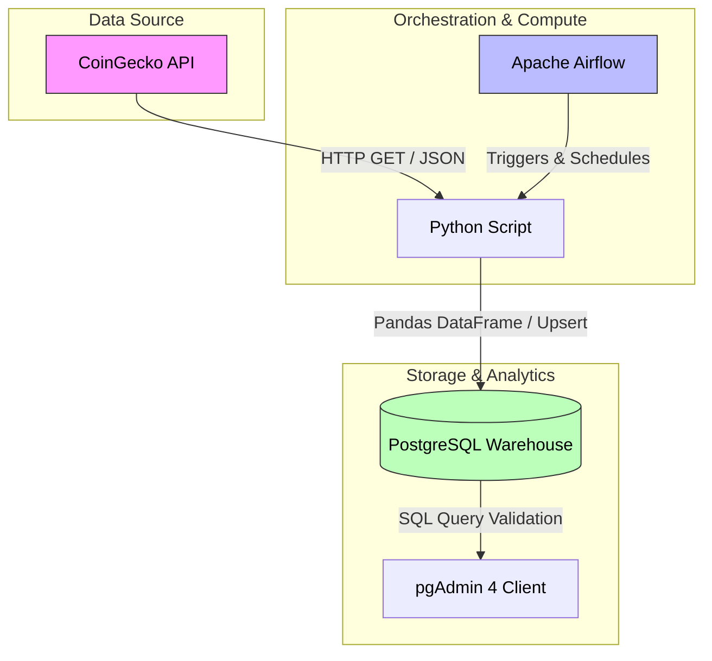

# Automated Crypto Market Data Pipeline (ELT)

An end-to-end local data engineering pipeline that automatically extracts live cryptocurrency metrics from a public REST API, transforms and structures the nested data schemas, and loads the historical records into a containerized PostgreSQL data warehouse. The entire workflow is fully orchestrated using Apache Airflow as a Directed Acyclic Graph (DAG).

## 🏗️ Architecture Overview

The system architecture is fully containerized and uses the following automated data flow:



## 🛠️ Tech Stack & Core Concepts

* **Orchestration:** Apache Airflow (Standalone Mode running inside Docker)
* **Database Container:** PostgreSQL 15 (Target Data Warehouse Client)
* **Languages & Libraries:** Python 3.10, Pandas, Psycopg2, Requests
* **Database Management:** pgAdmin 4
* **Infrastructure:** Docker & Docker Compose
* **Data Engineering Concepts Implemented:**
  * **Idempotency:** Utilized `ON CONFLICT DO NOTHING` database constraints to handle repeated pipeline executions seamlessly without duplicating operational records.
  * **Historical Logging:** Designed a composite primary key system (`coin_id`, `extracted_at`) to transition the ingestion pipeline from a volatile overwrite style into a persistent append-only analytical ledger.
  * **Containerized Decoupling:** Isolated environmental variables, file mounts, and cross-service communication via an internal Docker network bridge.

## 📂 Project Structure

```text
local_de_pipeline/
│
├── dags/
│   └── pipeline.py          # Unified Airflow DAG containing ELT task blocks
│
├── docker-compose.yml       # Multi-container infrastructure script
└── README.md                # Technical documentation and deployment roadmap
```

## 🚀 Step-by-Step Deployment Guide

### 1. Prerequisites
Ensure you have the following frameworks operational on your host machine:
* Python 3.10+
* Docker Desktop (Running in background context)

### 2. Clone and Initialize Environment
Navigate into your localized project space and trigger the Docker daemon to deploy the microservice network:

```bash
# Navigate to the repository locally
cd local_de_pipeline

# Spin up the infrastructure stack in detached mode
docker-compose up -d
```

### 3. Accessing the Ecosystem Dashboards

* **Apache Airflow Orchestrator:** Navigate to `http://localhost:8081`. The authentication wrapper is systematically configured for developer-anonymous access, providing direct administrative entry to the DAG grid panel.
* **pgAdmin Database Viewer:** Navigate to `http://localhost:8080`.
  * **Username:** `admin@de.com`
  * **Password:** `adminpassword`

To link pgAdmin to the database instance, register a new server using the internal network host address `postgres_warehouse`, database port `5432`, user `de_user`, and password `de_password`.

## 📊 Analytical Data Verification

Once the `crypto_extraction_pipeline` DAG is unpaused and executed inside the Airflow panel, rows are injected directly into the target database. Run this window-function query in the pgAdmin scratchpad to evaluate the variance profiles of the historical crypto trends:

```sql
SELECT 
    coin_id,
    price_usd,
    extracted_at,
    AVG(price_usd) OVER (PARTITION BY coin_id) as avg_tracked_price,
    price_usd - AVG(price_usd) OVER (PARTITION BY coin_id) as variance_from_avg
FROM 
    market_metrics_staging
ORDER BY 
    coin_id, 
    extracted_at DESC;
```

---
💡 *Developed as a practical case study demonstrating modern data pipeline orchestration and localized container infrastructures.*